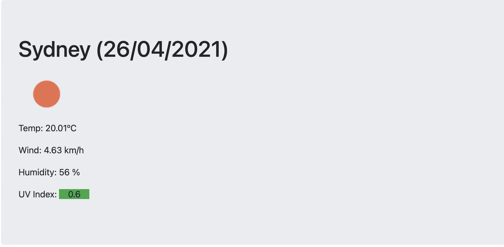
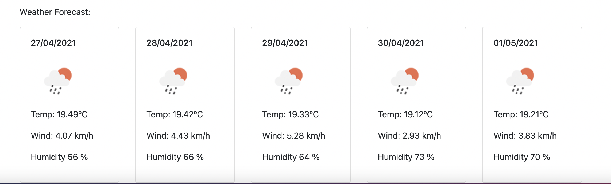
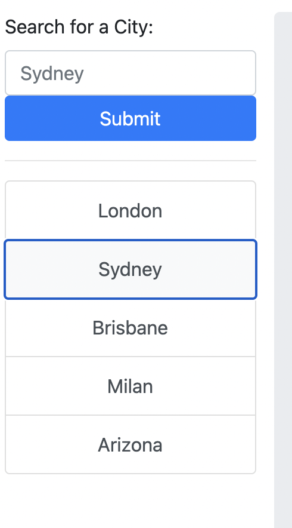

# weather-forecast

Description: This page allows you to look up any city in the world and view its current temperature, wind speed, humidity and UV conditions. It also provides a forecast for the coming 5 days. The cities are saved so you can easily access them each time you visit the site.

Technologies:
HTML
JavaScript
OpenWeather API to retireve data about current and future weather conditions
Local Storage to save past searches

URL: https://madsterest.github.io/weather-forecast/

